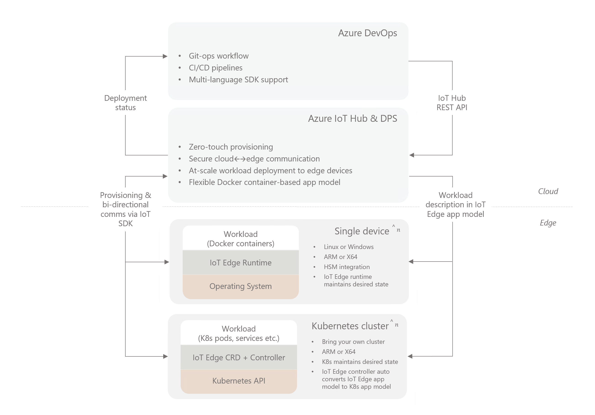

## Introduction

Azure IoT Edge can integrate with Kubernetes, using it as a resilient, highly available infrastructure layer. It registers an IoT Edge Custom Resource Definition (CRD) with the Kubernetes API Server and provides a CRD controller that reconciles cloud-managed desired state with the local cluster state.

Module lifetime is managed by the Kubernetes scheduler, which maintains module availability and chooses their placement. IoT Edge manages the edge application platform running on top, continuously reconciling the desired state specified in IoT Hub with the state on the edge cluster. The edge application model is still the familiar model based on IoT Edge modules and routes. The IoT Edge agent performs the role of a CRD controller, automatically *translating* from IoT Edge application model to Kubernetes native constructs like pods, deployments, services etc.

The high level diagram above might help you understand where Kubernetes fits in a typical production IoT Edge architecture.

>💡
>
> A good mental model for this integration is to think of Kubernetes as another operating environment IoT Edge applications can run on in addition to Linux and Windows.

